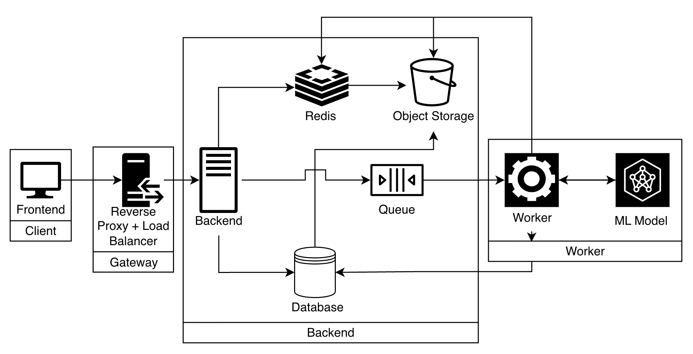

## Karaoke Expert

### Design Diagram

### Design Explanation
#### Client
Write later

#### Gateway
The gateway layer acts as an abstraction between the client and the backend. It handles REST API requests from the client and handles routing and load balancing to a backend container.

#### Backend
Call create upload
Use presigned url to upload song to bucket
Call process song
    this does stuff in the background
Use get song to poll if the song is done
Once the song is done you're good to go

#### Worker
The worker has been decoupled from the backend to make it separately scalable. The worker reads from the queue and calls its ML model to convert the mix spectrogram into a instrumental spectrogram. The worker then uploads the clip into an object store and updates song status in Redis. Finally, it notifies the backend to that an entire song has been uploaded.

## Questions/Comments

how does the worker notify the backend? Does it use something like SNS?

I don't think the worker needs access to the backend, so this will need to change.

The backend should have an arrow pointing to object storage.

